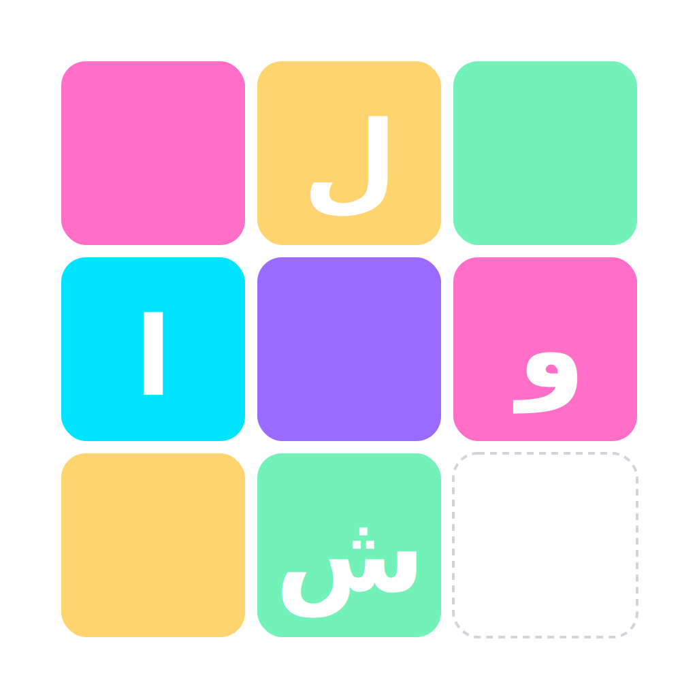

<p align="center">
	
</p>

<p align="center">
  <a href="README.md">English</a> | <strong>فارسی</strong>
</p>

<h1 align="center">بازی لواش — پازل کشویی تصویری</h1>

لواش یک بازی پازل کشویی مینیمال و چشم‌نواز است که تصویر انتخابی شما را به چندین قطعه مربعی تقسیم می‌کند؛ با جابه‌جایی هوشمندانهٔ قطعات و استفاده از خانهٔ خالی، تلاش کنید تصویر اصلی را دوباره بسازید. از عکس‌های آماده استفاده کنید یا عکس خودتان را از گالری وارد کنید و رکورد بزنید!


## امکانات ✨

- انتخاب تصویر از میان تصاویر آماده یا گالری دستگاه
- پشتیبانی از ابعاد مختلف پازل: ۳×۳ تا ۸×۸
- حالت تیره/روشن و تم‌های رنگی مبتنی بر Material 3
- نمایش/عدم نمایش شمارهٔ تایل‌ها برای کمک بصری
- ذخیرهٔ خودکار بازی و ادامه از آخرین وضعیت
- ثبت بهترین رکوردها (کمترین حرکت و سریع‌ترین زمان) برای هر بُعد
- پشتیبانی از زبان فارسی و انگلیسی
- انیمیشن‌ها و طراحی مدرن با فونت فارسی «وزیرمتن»


## نحوهٔ بازی 🧩

1) یک تصویر انتخاب کنید: از اسلایدر بالای صفحه، یکی از تصاویر آماده را برگزینید یا با دکمهٔ «تصویر» عکس دلخواهتان را از گالری انتخاب کنید.
2) پازل شروع می‌شود: تصویر به قطعات مربعی به‌همراه یک خانهٔ خالی تقسیم می‌شود.
3) حرکت دهید: روی هر قطعهٔ مجاورِ خانهٔ خالی بزنید تا به جای خالی جابه‌جا شود.
4) هدف: همهٔ قطعات را طوری بچینید که تصویر اصلی شکل بگیرد. وقتی برنده شوید، تعداد حرکت‌ها و زمان شما نمایش داده می‌شود.

نکته‌ها:
- قطعاتی که در جای درست خود قرار گرفته‌اند با حاشیهٔ سبز مشخص می‌شوند.
- از «جابه‌جایی» استفاده کنید تا چند قطعهٔ نامرتب با هم جابه‌جا شوند و چیدمان تغییر کند.
- از «تنظیمات» می‌توانید ابعاد پازل، نمایش اعداد تایل‌ها، تم روشن/تیره و زبان را تغییر دهید.


## اجرای پروژه 🚀

نیازمندی‌ها:
- Flutter 3.24+ و Dart 3.9+
- SDKهای پلتفرم مقصد (Android/iOS/Web/Desktop)

گام‌ها:
1) دریافت پکیج‌ها
2) اجرای برنامه روی پلتفرم دلخواه

دستورات پیشنهادی:

```sh
flutter pub get
flutter run -d chrome         # اجرای وب
# یا
flutter run -d android        # اجرای اندروید (شبیه‌ساز/دستگاه متصل)
# یا
flutter run -d linux          # اجرای دسکتاپ (در صورت فعال بودن)
```

آدرس فایل‌های کلیدی:
- نقطهٔ ورود برنامه: `lib/main.dart`
- صفحه/منطق اصلی بازی: `lib/screens/home_screen.dart`
- مدل و منطق پازل (صفحه‌بندی، حرکت، حل‌بودن، درهم‌ریزی معتبر): `lib/models/puzzle.dart`
- متن‌ها و چندزبانه: `lib/core/strings.dart`
- ابزارهای تصویر و تبدیل: `lib/core/image_utils.dart`, `lib/core/utils.dart`
- ویجت‌های UI پازل و اکشن‌بار: `lib/widgets/puzzle_widgets.dart`


## ساختار و معماری کد 🏗️

- مدل داده: `PuzzleBoard` و `Tile`، با بررسی حل‌بودن، همسایه‌های قابل‌حرکت و جابه‌جایی ایمن.
- درهم‌ریزی معتبر: الگوریتم شافل با کنترل «حل‌پذیری» (Inversion Count) برای اطمینان از امکان حل.
- مدیریت حالت: `StatefulWidget` سطح بالا با ذخیره‌سازی در `SharedPreferences` (تنظیمات، رکوردها، آخرین وضعیت بازی).
- برش تصویر: تولید قطعات تصویری با Canvas و `ui.Image` برای رندر باکیفیت در هر اندازه.
- تجربهٔ کاربری: طراحی راست‌به‌چپ، فونت «وزیرمتن»، Material 3، حالت تیره/روشن، و انیمیشن برد.


## تکنولوژی‌ها و وابستگی‌ها 🛠️

- Flutter (Material 3)
- google_fonts — فونت «Vazirmatn»
- image_picker — انتخاب تصویر از گالری/دوربین
- shared_preferences — ذخیرهٔ تنظیمات، رکوردها و وضعیت بازی
- path_provider و path — مسیرها و فایل‌های محلی (ذخیرهٔ تصاویر کاربر)

برای دیدن فهرست کامل، فایل `pubspec.yaml` را ببینید.


## تست‌ها ✅

برای اجرای تست‌ها:

```sh
flutter test
```

نمونه تست‌ها در پوشهٔ `test/` قرار دارند؛ شامل منطق پازل، ابزارهای تصویر و رشته‌ها.


## مشارکت 🤝

مشارکت شما استقبال می‌شود! برای افزودن قابلیت‌ها یا بهبودها:

1) یک Issue ایجاد کنید و تغییر مدنظرتان را شرح دهید.
2) یک Fork بگیرید و شاخهٔ جدید بسازید: `feature/my-awesome-idea`
3) تغییرات را همراه با توضیحات و اسکرین‌شات/گیف (در صورت نیاز) در Pull Request ارسال کنید.
4) قواعد کدنویسی و lints را رعایت کنید و تست‌ها را تا حد امکان بنویسید/بروزرسانی کنید.


## مجوز 📄

این پروژه تحت مجوز MIT منتشر شده است. برای جزئیات، فایل `LICENSE` (در صورت وجود) را مشاهده کنید؛ در غیر این صورت، ارسال‌کنندهٔ PR می‌تواند پیشنهاد مجوز بدهد.


## قدردانی از فونت

این برنامه از فونت [«وزیرمتن»](https://fonts.google.com/specimen/Vazirmatn) استفاده می‌کند که توسط زنده‌یاد [«صابر راستی‌کردار»](https://fa.wikipedia.org/wiki/%D8%B5%D8%A7%D8%A8%D8%B1_%D8%B1%D8%A7%D8%B3%D8%AA%DB%8C%E2%80%8C%DA%A9%D8%B1%D8%AF%D8%A7%D8%B1‌) ساخته شده است. ضمن قدردانی صمیمانه از تلاش‌ها و آثار ارزشمند ایشان، برای آن مرحوم رحمت و غفران الهی مسئلت داریم.


---

اگر این پروژه را دوست داشتید، با دادن ⭐️ در گیت‌هاب از آن حمایت کنید و نظراتتان را با ما در میان بگذارید.
